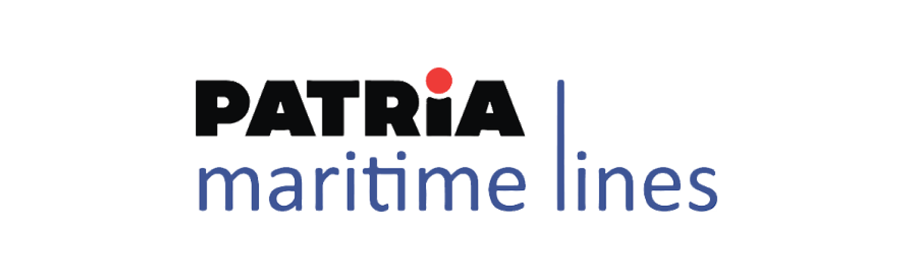

# Tugas Akhir Teknik Elektro Universitas Diponegoro

# PML-SHIP (Admin Side)
Github repository of Tugas Akhir Teknik Elektro Universitas Diponegoro

# TODO
- [ ] Fix main.dart route (For now I used `'/': (context) => CustomerDocumentDataPage(),`)
- [ ] Fix navigator context in '/verify-customer' in customer_data_card.dart and verify_customer_data.dart
- [ ] 7 more page slicing
- [ ] Fix error in document folder, all page. Suspect Flexible Widget

# About The Project
As a shipping company, [PT Patria Maritime Lines](https://pml.co.id/) experiences difficulties in managing customer orders. Previously customer orders came via telephone or email. It is hoped that the PML-SHIP application can move customer orders from telephone/email to ordering via the application

# Team Member
## Team ID / Document Number: 837
| Name | Student ID | Contact |
| --- | --- | --- |
| FADHIL PRAWIRA | 21060120140057 |   |
| DANI SEFIANTO | 21060120120024 |   |
| QORY WILJANOVA | 21060120140110 |   |

<!-- reference https://github.com/alexandresanlim/Badges4-README.md-Profile -->

# Resource
1. Use Case Diagram
2. Activity Diagram
3. Sequence Diagram
4. UI/UX (Figma)
    - User Flow
    - Information Architecture (IA)
    - Wireframe/Low-Fidelity Prototype
    - Mockup/High-Fidelity Prototype
    - Prototype (Clickable)

# Technology Used
1. Android
    - [Flutter 3.19.3](https://flutter.dev/)
2. Backend
    - [Laravel 10](https://laravel.com/)
3. Design
    - [Figma](https://www.figma.com/)

# Contributing
We are very open to any input, therefore we want to make contributing to this project as easy and transparent as possible, whether it's:

- Reporting a bug
- Discussing the current state of the code
- Submitting a fix
- Proposing new features
- Becoming a maintainer

If you think something important is missing or should be different based on your experience, we'd love to have you contribute to this project. If you have suggestions for improving these apps, please [contact](https://github.com/fadhilprawira/pml_ship_admin#team-member) the existing ones.

# Acknowledgments
||
|:--:|
|Departemen Teknik Elektro Universitas Diponegoro|

||
|:--:|
|PT Patria Maritime Lines|